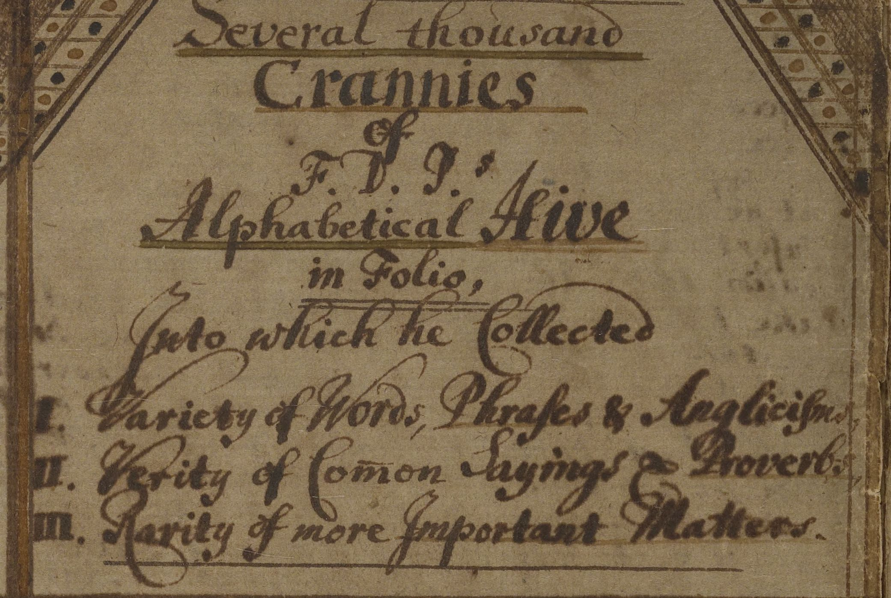

---
# This page uses Hydejack's `about` layout, which shows the primary author's picture and about text at the top.
# You can change it to the regular `page` layout if you want.
layout: about

# The title of the page.
title: About

# Write a short (~150 characters) description of each blog post.
# This description is used to preview the page on search engines, social media, etc.
description: >
  About the digital presence of Francis Daniel Pastorius' Beehive Manuscript.

# You can show the description on the page by deleting this line:
hide_description: true

# TODO
image: /assets/img/beehive-1/jpg.
---

Pastorius' Beehive
{:.lead}

{:.lead}
The index of Pastorius' Beehive Manuscript.
{:.figure}

More information on the Beehive coming soon!
